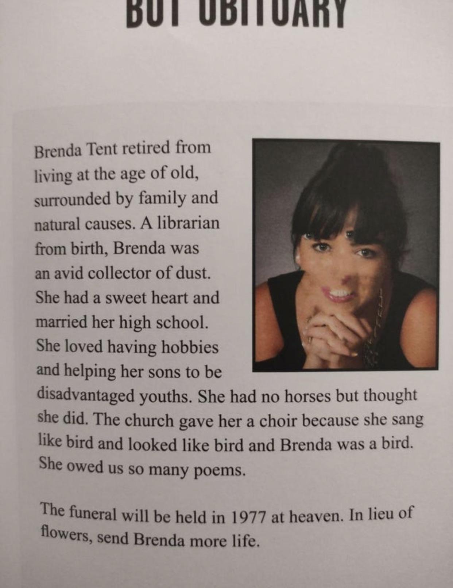

# Dissman "Artist" Statement
I have made 5 children's books, and Dissman is the most childish project I have allowed into the world. It is mostly a reflection of skills and interests build up over time, and an attempt to put them together in a package for the show. However, a good insult is art, and the challenge here is to find an algorithmic way to generate good insults. Not necessarily a good insult every time, but generate insults in bulk to stumble into some gemss.

There are 2 main parts of Dissman. One is older computing with traditional algorithms; the other uses Open AI's Dall-E 2 API. The "insult generator" portion of the project is built from code I wrote trying to teach myself string (word) manipulation for the first time as a completely inexperienced teacher of high school computer science. The underlying logic is simple: take a list of insulting adjectives and list of insulting nouns, choose one from each list at random, and put them together. I find myself always making note of creative, funny insults, and they usually follow the pattern of using an [adjective][noun] combination in a way I would have never expected. Dissman gets to a similar result through sheer volume.

The Open AI portion is even simplier in some ways. While the underlying technology is complex, Dissman just takes whatever Dall-E gives. I intented to use generative AI with a user picture and a prompt to put them in a setting or modify their appearance inspired by the insult. I tested Dall-E 2, the only version of Open AIs image generator that allows you to submit a picture, with an image of myself, and the output was just a slightly worse version of myself. It was hilarious that this was the sophisicated tool that they had made available -- a way to make yourself look worse -- and ultimately, in my code, Dissman just sends a picture to Dall-E 2 and shows what comes back.

My interest in AI generally, and text generation in particular, started when this AI generated obituary made the rounds on the internet.

Like _Total Recall_, it's wonderful because it is terrible, but it also hits some artistic notes. "She owed us so many poems." It also manages to scrape some truth. "In lieu of flowers, send Brenda more life." Isn't that what Brenda would really prefer?

What really captured me is the non-linear construction of ideas. My mind usually goes from A-to-B. This bot goes from A-to-hot dog. I thought, "Can I get computers to compensate and do my non-linear thinking for me?" Some other projects on my github are reflections of these attempts in writing lyrics and music. The results are even worse then Brenda's obituary, but sometimes, they are just as fun and interesting. There are seashells in the wrack. 

While I still have plenty of unrealized ideas for the software, the case really had no vision behind it until the very end. I was talking with Allen about not have a physical conception of Dissman, and he said, "I think it's a really juvenile idea... and I mean that in the best possible way." He pitched Dissman a middle school bully, and that made sense and got me rolling. My wife, Grace, picked out the toaster oven head and helped me choose the source material for the case, a baby's tactile toy. That allowed me to go beyond juvenile to infanile, and Dissman is now fully realized as his pointless atomic age robot toy self.   

## An open letter to myself/project post mortem

I spent way more time than I expected on this project. I experienced a lot more frustration and far less joy than I expected on this project. When this kind of thing happens, I compensate for lost time and frustration in evaluating where things went wrong and would could be done better in future projects.

There were two main areas of the project where I struggled:
1) creating the user interface
2) getting the hardware to interact with the software correctly

In light of these struggles, I have some new lessons for myself:
1. If you are having to learn how to use a new tool to get the job done, learn the tool you really want to learn how to use.
  - I created Dissman in Python, and I realized pretty quickly that I would need a more robust user interface than the library that I was using initially, tkinker. ChatGPT recommended another Python library, kivy, for the interface. However, despite having a fair amount of Python experience, learning the new library was challenging, and I'm still not sure that I fully get it. In retrospect, I wish I had invested the time into learning a more powerful and flexible tool that I would probably want to use in future projects, Unity. While I'm talking about Python libraries, I suspect this lesson applies to analog tools as well; don't cut metal with a Dremel when you want to get better at using a plasma cutter, or whatever,  
2. ChatGPT can tell you how to do it, but you still should decide whether you should do it.
3. When using new hardware, start with a tutorial that uses that exact hardware.
4) Personal projects are like professional projects in scope. Think about how long you really think it will take, and then multiply that by 3 or 4. That's the good estimate.
5) Take the Home Depot approach and buy more hardware than you need. Don't get held up by lack of hardware or broken hardware. Buy more than one of everything with the expectations that you will have to make returns.
